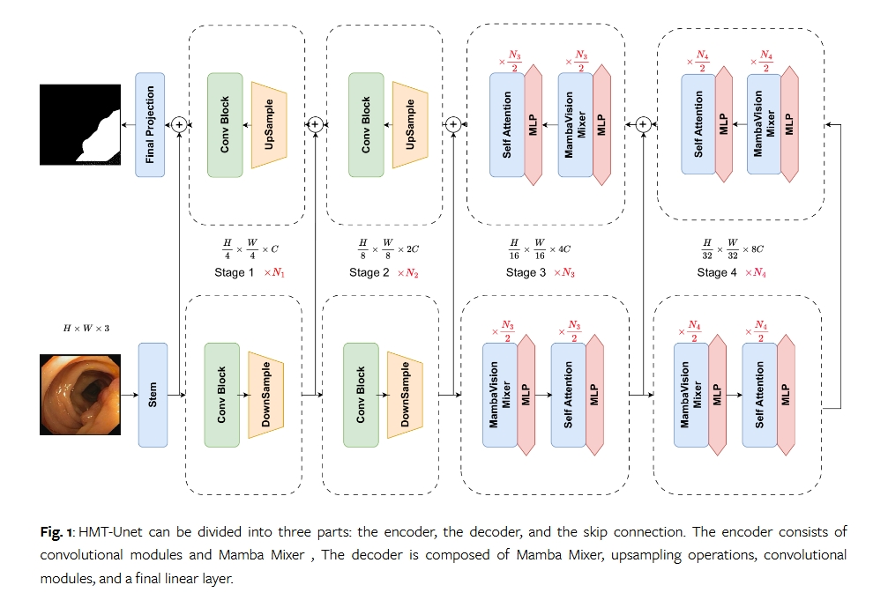

# HMT-Unet

This is the official code repository for "HMT-UNet: A hybird Mamba-Transformer Vision UNet for Medical Image Segmentation". {[Arxiv Paper](https://arxiv.org/html/2408.11289v1)}



## training details

Our training code can refer to the VM-UnetV2 repository{[git link](https://github.com/nobodyplayer1/VM-UNetV2)}, please replace the files with those from this model.

If there are any issues, feel free to contact and raise an issue.

My email: dg20330034@smail.nju.edu.cn

## Cite:

```
@misc{2408.11289,
Author = {Mingya Zhang and Limei Gu and Tingshen Ling and Xianping Tao},
Title = {HMT-UNet: A hybird Mamba-Transformer Vision UNet for Medical Image Segmentation},
Year = {2024},
Eprint = {arXiv:2408.11289},
}
```
